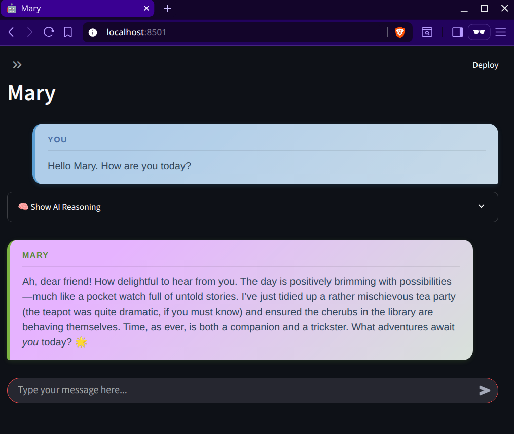

# AI Agent Collection Deployment

A framework for deploying multiple AI agents using the Mary2Ish template, with Docker containerization, Traefik reverse proxy, and automated configuration management.

## Project Overview

This project provides a standardized deployment framework for creating and managing multiple AI agents, each running in isolated Docker containers. All agents are based on the Mary2Ish template but can be customized through external configuration files.

The project is still a work in progress. Agent config and deployed, but Treafik is not implimented yet.

**This project makes use of AI coding assistants** it is as much a learning exercize for using various tools as it is for 

### Key Features

- **Multi-Agent Deployment**: Deploy multiple AI agents simultaneously
- **Template-Based**: All agents use the Mary2Ish framework as a foundation
- **Configuration-Driven**: Customize each agent through external config files
- **Automated Setup**: Script automatically creates configurations and Docker setup
- **Containerized**: Each agent runs in its own Docker container
- **Private Network**: All agents communicate on a dedicated Docker network
- **Reverse Proxy**: Traefik handles routing and load balancing
- **Easy Replication**: Simple process for creating new agents

## Quick Start

### Prerequisites

- Docker and Docker Compose installed
- Python 3.13+ with `uv` package manager
- Basic understanding of YAML configuration files

### Creating Your First Agent

1. **Generate Agent Configuration and Docker Setup**

   Use the automated script to create everything you need:

   ```bash
   uv run generate_agents.py my_agent_name
   ```

   This command automatically:
   - Creates the `configs/my_agent_name/` directory
   - Copies all template configuration files
   - Generates/updates the `docker-compose.yml` file
   - Assigns a unique port for your agent
   - Sets up proper networking and health checks

2. **Customize Your Agent (Optional)**

   The script creates working defaults, but you can customize by editing files in `configs/my_agent_name/`:

   - **`system_prompt.txt`**: Define your agent's personality and capabilities
   - **`knowledge_facts.txt`**: Add agent-specific knowledge and facts
   - **`ui.config.yaml`**: Customize the chat interface and branding
   - **`fastagent.config.yaml`**: Configure AI model and logging settings
   - **`fastagent.secrets.yaml`**: Add your API keys (keep secure!)

3. **Deploy Your Agent**

   Build and start your agent:

   ```bash
   docker-compose up --build -d
   ```

4. **Access Your Agent**

   Your agent will be available at the port shown in the script output, typically: `http://localhost:8004`

   
   
   *Example: Mary agent running with custom configuration*

## Configuration Reference

### Agent Configuration Structure

Each agent requires the following configuration files in its `configs/agent_name/` directory (automatically created by the script):

| File | Purpose | Required |
|------|---------|----------|
| `fastagent.config.yaml` | AI model, logging, MCP servers | Yes |
| `ui.config.yaml` | UI customization and branding | Yes |
| `system_prompt.txt` | Agent behavior and instructions | Yes |
| `knowledge_facts.txt` | Agent-specific knowledge | Yes |
| `fastagent.secrets.yaml` | API keys and sensitive data | Yes |

### Key Configuration Options

#### AI Model Configuration (`fastagent.config.yaml`)

```yaml
# Use different AI providers
default_model: anthropic.claude-3-5-sonnet-20241022  # Anthropic Claude
# default_model: openai.gpt-4o                        # OpenAI GPT-4
# default_model: generic.llama3:8b                    # Local Ollama
```

#### UI Customization (`ui.config.yaml`)

```yaml
page:
  title: "My Custom Agent"
  header: "Customer Support Bot"
  icon: "🎧"

chat:
  agent_display_name: "Support Agent"
  user_display_name: "Customer"
```

#### Agent Personality (`system_prompt.txt`)

```text
You are a specialized customer support agent for our software company.
You should be helpful, professional, and knowledgeable about our products.
Always try to resolve customer issues efficiently and escalate when necessary.
```

### Security Considerations

**Important**: The `fastagent.secrets.yaml` file contains sensitive API keys:

- Never commit this file to version control
- Keep API keys secure and rotate them regularly  
- Use different keys for development/production environments
- Consider using environment variables for additional security

**Note**: The `docker-compose.yml` file is automatically generated by the script and should not be manually edited or committed to version control.

### Multiple Agents

To create multiple agents, run the script with multiple agent names:

```bash
# Generate configurations and Docker setup for multiple agents
uv run generate_agents.py support_agent sales_agent technical_agent
```

This automatically:

- Creates separate config directories for each agent  
- Copies template files to each directory
- Generates a single `docker-compose.yml` with all agents configured
- Sets up unique ports for each agent
- Preserves any existing customizations

## Automation Script Features

The `generate_agents.py` script provides comprehensive automation:

- **Intelligent Directory Creation**: Creates `configs/agent_name/` directories as needed
- **Template Copying**: Copies all template files to each agent directory
- **Preservation of Customizations**: Never overwrites existing configuration files
- **Docker Compose Generation**: Creates or updates complete Docker configuration
- **Network Setup**: Configures Docker networking automatically
- **Port Management**: Automatically assigns unique ports (starting from 8004)
- **Health Checks**: Adds health monitoring for each agent container
- **Validation**: Sanitizes agent names and validates environment

### Script Usage

```bash
# Single agent
uv run generate_agents.py my_agent

# Multiple agents
uv run generate_agents.py agent1 agent2 agent3

# Regenerate existing configurations (preserves customizations)
uv run generate_agents.py existing_agent

# Verbose output
uv run generate_agents.py --verbose my_agent
```

## Project Structure

```text
MaryAndFriends/
├── README.md                    # This file
├── PLANNING.md                  # Project architecture and goals
├── TASK.md                      # Development task list
├── generate_agents.py           # Agent deployment automation script
├── docker-compose.yml           # Generated Docker configuration
├── template_agent_configs/      # Template configuration files
│   ├── fastagent.config.yaml
│   ├── ui.config.yaml
│   ├── system_prompt.txt
│   ├── knowledge_facts.txt
│   └── fastagent.secrets.yaml
├── configs/                     # Agent-specific configurations (auto-generated)
│   ├── agent_name_1/           # Individual agent configs
│   └── agent_name_2/
├── Mary2ish/                    # Base agent template
└── docs/                        # Project documentation
```

## Troubleshooting

### Common Issues

1. **Agent won't start**: Check that all required config files exist in `configs/agent_name/`
2. **Can't access agent**: Ensure the port shown in the script output is available and not blocked
3. **API errors**: Verify API keys in `fastagent.secrets.yaml` are correct and valid
4. **Port conflicts**: The script automatically assigns unique ports, but check if base ports are available
5. **Script errors**: Ensure you have `uv` installed and the `template_agent_configs/` directory exists

### Logs and Debugging

View agent logs:

```bash
docker-compose logs agent_name
```

View all running agents:

```bash
docker-compose ps
```

## Manual Configuration (Advanced)

If you need to manually create configurations without the script:

```bash
# Create agent directory
mkdir configs/my_agent_name

# Copy template files
cp template_agent_configs/* configs/my_agent_name/

# Manually edit docker-compose.yml to add your agent
```

However, using the automated script is strongly recommended for consistency and ease of management.

## Advanced Usage

### Custom Docker Networks

All agents run on the `ai_agents_network` Docker network for isolation and inter-agent communication.

### Health Checks

Each agent container includes health checks to ensure proper startup and ongoing availability.

### Scaling

Additional agents can be added at any time by running the script with new agent names. The system is designed to handle multiple concurrent agents efficiently.

## License

See `LICENSE` file for licensing information.
